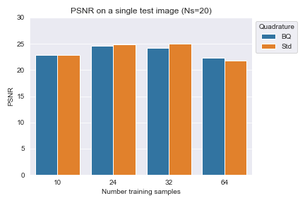
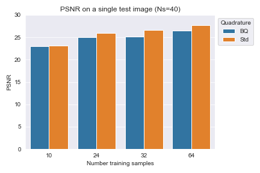
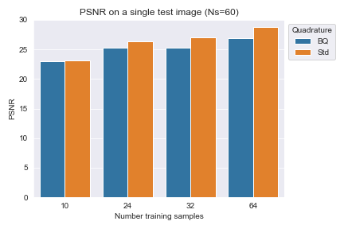

# BQNeRF

### What happens if we replace the rendering function of a NeRF with Bayesian quadrature?


This repo explores what happens if we assume transparency along the ray can be modelled using an RBF Kernel, and using this to compute the expected colour along each ray from samples drawn along these, along with it's uncertainty. This enables the use of a Gaussian log likelihood rendering loss, which accounts for sampling that may not necessarily be informative and opens up more options for localisation down the line. This repository implements a very basic coarse NeRF, and is based heavily on this excellent [NeRF from nothing tutorial](https://towardsdatascience.com/its-nerf-from-nothing-build-a-vanilla-nerf-with-pytorch-7846e4c45666). Let's start with some background.

### Volumetric Rendering in NeRFs

The standard volumetric rendering equation used in NeRFs models the colour perceived at the end of a ray $r=o+td$ using the integral:

$$ C(r) = \int_{t_0}^{t_f} T(t) \sigma(r(t)) c(r(t),d) dt $$

where

$$ T(t) = \exp \left(-\int_{t_0}^{t} \sigma(r(s)) ds\right) $$

This is approximated using Gaussian quadrature with stratified sampling along the ray.

$$ \hat{C}(r) = \sum_{i=1}^N T_i (1-\exp(-\sigma_i\delta_i))c_i $$

where

$$ T_i = \exp( - \sum_{j=1}^{i-1} \sigma_j \delta_j )$$ 

and $\delta_i$ is the distance between adjacent samples drawn along the ray.

### Bayesian quadrature

Bayesian quadrature typically uses a Gaussian process (GP) to apprximate an underlying integrand $f(x)$ using a set of samples $\[x_i, f(x_i)\]$, and then computes the integral by integrating the GP. Let's assume we model the integrand using a GP with mean function $m(x)$ and covariance function $k(x,x')$. The posterior distribution on $f$ is also a GP with mean and covariance:

$$ \mu(x) = m(x) + k(x,X)k(X,X)^{-1}f(X) $$

$$ \Sigma(x) = k(x,y) - k(x,X)k(X,X)^{-1}k(X,y) $$ 

Integrating this GP produces a distribution on the integral $v = \int f(x) dx$:

$$ \mathbb{E} \[{v(f)} \] = v[m] + v[k(.,X)]k(X,X)^{-1}f(X) $$

$$ \mathbb{V} \[{v(f)} \] = vv[k] + v[k(.,X)]k(X,X)^{-1}v[k(X,.)] $$

where

$$ v[k(.,x)] = \int k(x,y) dy $$

$$ vv[k(.,x)] = \int k(x,y)v(dx)v(dy) $$

For many kernel or covariance functions (eg. RBF, Matern, etc.), these can be computed analytically. This [tutorial notebook](tutorial/Intro%20to%20Bayesian%20quadrature.ipynb) explains this in more detail.

### Volumentric Rendering using Bayesian Quadrature and a RBF kernel

Let's return to the original rendering equation above:

$$ \hat{C}(r) = \int_{t_0}^{t_f} T(t) \sigma(r(t)) c(r(t),d) dt $$

and approximate this integral using Bayesian quadrature with a RBF kernel to produce a posterior over the rendering integral as computed above, given predicted colours $c_i$. We will keep the inner cummulative opacity integral ($T_i = \exp( - \sum_{j=1}^{i-1} \sigma_j \delta_j )$) because it is a bit of a stretch to repeatedly approximate this one with quadrature too. 

We will use this posterior to train our NeRF using a Gaussian negative log likelihood loss.

$$ \mathcal{L}  \propto \frac{1}{2} \left( \log \mathbb{V} \[{v(f)} \] + \frac{(\mathbb{E} \[{v(f)} \] - c_m)^2}{\[{v(f)} \]} \right) $$

where $c_m$ is the pixel colour value of an image measurement.


### How to try this out?

Train a model with Bayesian Quadrature and an RBF kernel
```
python3 train.py --bq BQ --nsamples 64 --lr 5e-4 --epochs 5000
```
Train a model with Gaussian Quadrature
```
python3 train.py --bq Std --nsamples 64 --lr 5e-4 --epochs 5000
```

This will log images, videos and model checkpoints at an alarming frequency. You can play around with a trained model using the jupyter notebook.

### So, how does it do?

Re-running these results after fixing rendering bug. This is only on a *single* test image, so could change at scale, but I suspect this is not the case. 







